# Comp3010

---

## Table of Contents

- [Introduction](#introduction)
- [SOC Roles & Incident Handling](#soc-roles--incident-handling)
  - [SOC Tiers and Responsibilities](#soc-tiers-and-responsibilities)
    - [Tier 1 (Triage and Monitoring)](#tier-1-triage-and-monitoring)
    - [Tier 2 (Incident Investigation)](#tier-2-incident-investigation)
    - [Tier 3 (Threat Hunting and Specialist Expertise)](#tier-3-threat-hunting-and-specialist-expertise)
    - [In Context of the Dataset](#in-context-of-the-dataset)
- [Incident Handling Method](#incident-handling-method)
  - [Splunk Installation and Data Preparation](#splunk-installiation-and-data-prepration)
    - [Installing Splunk](#installing-splunk)
    - [Adding the License](#adding-the-license)
    - [Installing the Dataset](#installing-the-dataset)
    - [Validation of Correct Installation and Setup](#validation-of-correct-installation-and-setup)
    - [Stopping Splunk](#stopping-splunk)
- [Incident Overview](#incident-overview)
  - [Table 1 - Incident Timeline](#table-1---incident-timeline)
  - [Table 2 - Key Indicators of Compromise](#table-2---key-indicators-of-compromise)
- [Guided Investigation Findings](#guided-investigation-findings)
  - [Guided Questions and Answers](#guided-questions-and-answers)
  - [Indentity and Access Management Activity](#indentity-and-access-management-activity)
  - [Cloud Storage Misconfiguration](#cloud-storage-misconfiguration)
  - [Endpoint Anomaly Detection](#endpoint-anomaly-detection)
  - [Table 3 - Evidence and Best Practices Corroboration](#table-3---evidence-and-best-practices-corroboration)
  - [Table 4 - Damage Assessment](#table-4---damage-assessment)
- [Additional Investigation Findings](#additional-investigation-findings)
  - [Evidence of Phishing and Malware Execution](#evidence-of-phishing-and-malware-execution)
  - [Evidence of Command and Control Communication](#evidence-of-command-and-control-communication)
  - [Evidence of Cryptocurrency Mining Activity](#evidence-of-cryptocurrency-mining-activity)
  - [Evidence Correlation](#evidence-correlation)
- [External Threat Intelligence](#external-threat-intelligence)
  - [Key Observations](#key-observations)
  - [Coin Mining Malware](#coin-mining-malware)
  - [Phishing Campaigns](#phishing-campaigns)
  - [Command-and-control (C2)](#command-and-control-c2)
  - [S3 Bucket Misconfiguration](#s3-bucket-misconfiguration)
  - [How This Informs Analysis](#how-this-informs-analysis)
- [Operational and Business Impact](#operational-and-business-impact)
  - [Impact on SOC Operations and Resources](#impact-on-soc-operations-and-resources)
  - [Impact on Identity and Access Management (IAM)](#impact-on-identity-and-access-management-iam)
  - [Impact on System Availability and Performance](#impact-on-system-availability-and-performance)
  - [Impact on Business Continuity and Productivity](#impact-on-business-continuity-and-productivity)
  - [Impact on Security Posture and Future Operations](#impact-on-security-posture-and-future-operations)
  - [Reputational and Compliance Considerations](#reputational-and-compliance-considerations)
  - [Overall Operational Impact](#overall-operational-impact)
- [Incident Response and Recovery](#incident-response-and-recovery)
  - [Detection](#detection)
  - [Route Cause](#route-cause)
  - [Containment](#containment)
  - [Recovery Timeline](#recovery-timeline)
- [SOC Refelection and Lessons Learned](#soc-refelection-and-lessons-learned)
  - [Table 6 - Recommendations and Action Plan](#table-6---recommendations-and-action-plan)
- [Conclusion](#conclusion)
- [References](#references)
- [AI Transcripts](#ai-transcripts)

---

# Introduction
This report investigates Boss of the SOC v3 (BOTSv3) dataset, which is a publicly available Splunk Capture the Flag scenario which simulates a cyber-attack against the fictional brewing company Frothly. The Capture the Flag (CTF) is designed for security operational professionals to practice their incident detection and network forensics skills. Analyst are based in the Security Operations Centre (SOC).

---

# SOC Roles & Incident Handling
The BOTSv3 exercise s demonstrates Security Operations Centre (SOC) roles and incident handling methodologies work hand in hand during a cyber incident investigation. Typically, SOC analysts are divided into tiers based on experience and responsibilities (Enoch Agyepong, 2020). Despite the tier structure, many tasks and responsibilities overlap.

---

## SOC Tiers and Responsibilities

### Tier 1 (Triage and Monitoring)

Tier 1 analysts are often the least experienced analysts, deal with most of the communications directed to the SOC, triaging events, initialising investigations and managing most incidents. When an event requires further investigation Tier 1 analysts escalate to Tier 2. 

### Tier 2 (Incident Investigation)

Tier 2 analysts are responsible for more in-depth analysis of the incident and have additional responsibilities like signature turning, device configuration, vulnerability management, configuring log and event collectors.   Once an incident is transferred, Tier 2 manages the ticket until its resolved and closed or escalated to Tier 3. 

### Tier 3 (Threat Hunting and Specialist Expertise)

Tier 3 analysts are usually the most experienced, dealing with the incidents raised by Tier 2, sharing and managing threat intelligence, handling configuration and implementation of security tools. 

### In Context of the Dataset

Within the investigation, these SOC tier responsibilities are reflected in the guided questions. Tier 1 activities are in the initial log review and identification of suspicious activity. Tier 2 requires correlation from multiple log sources, timeline construction, and identification of compromised IAM accounts. Tier 3 undertakes threat hunting and specialist analysis activities, such as interpreting attacker behaviour, assessing impact and identifying security control gaps. This demonstrates how the BOTSv3 exercise models a realistic SOC workflow, with incidents progressing through tiers as analysis depth and complexity increase.

---

# Incident Handling Method

## Splunk Installiation and Data Prepration
Below are step by step instructions which I took to investigate the BOTSv3 dataset. For reproducibility here are the steps:

---

### Installing Splunk

1. Create an account with Splunk Enterprise  

https://www.splunk.com/en_us/products/splunk-enterprise.html

2. Navigate to the Linux download and copy the .tgz wget link. 

https://www.splunk.com/en_us/download/splunk-enterprise.html

The .tgz wget link should look a little like this:  

*wget -O splunk-10.0.2-e2d18b4767e9-linux-amd64.tgz "https://download.splunk.com/products/splunk/releases/10.0.2/linux/splunk-10.0.2-e2d18b4767e9-linux-amd64.tgz"*

 

3. Open Ubuntu Virtual Machine

4. Open terminal on the VM

5. Navigate to the Desktop directory

6. Paste the link into the terminal and execute.

 

 

 NOT SURE 

7. Install Splunk using the command:  

*sudo tar xvzf splunk-10.0.1-c486717c32b-linux-amd64.tgz -C /opt/*

 

 

8. To run Splunk navigate to the directory opt/splunk/bin and use the command:  

*./splunk start --accept-license*

 

 

9. Sign in using an administrator account  

10. Create an administrator account for Splunk

11. Sign in when prompted

12. Follow the link to the locally hosted application

---

### Adding the License

1. Whilst inside the Ubuntu Virtual Machine, navigate to the license file stored on the dle

2. Save the file into the downloads

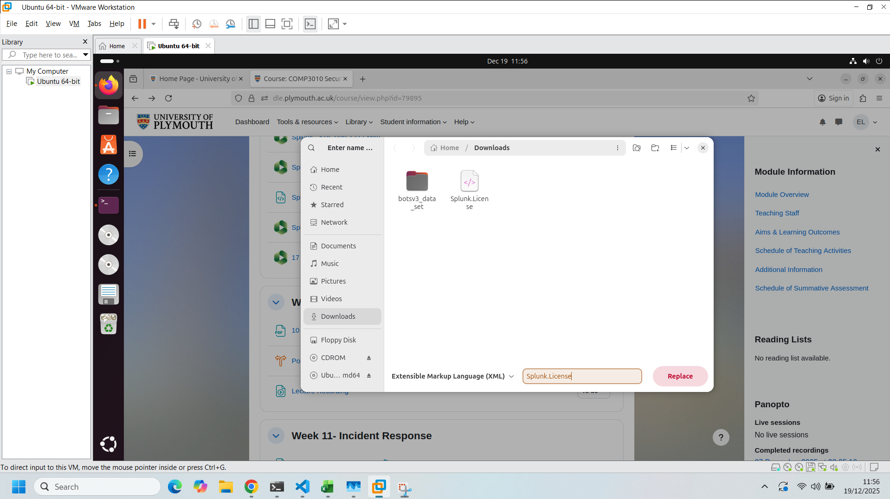

3. Run the splunk application

4. Open settings and then licensing

5. Upload the license from your downloads to your account

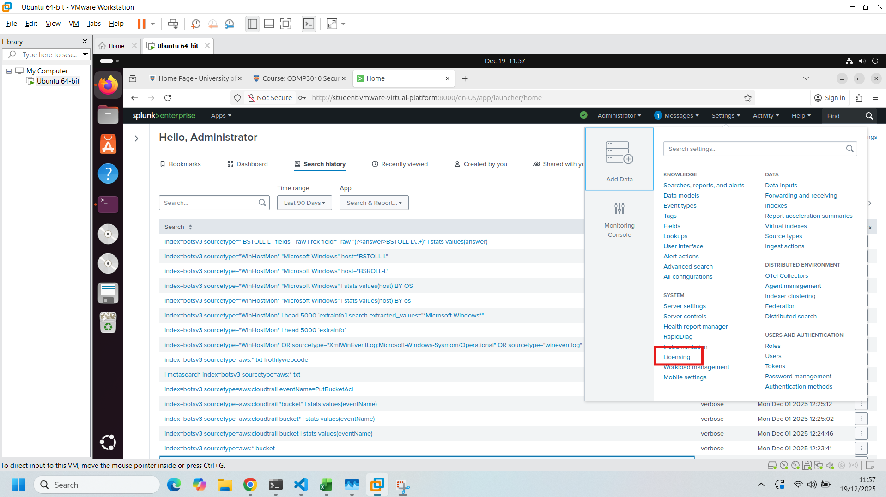

---

### Installing the Dataset

1. Whilst inside the VM, navigate to the Boss of the SOC (BOTS) Dataset Version 3 GitHub page  

https://github.com/splunk/botsv3

2. Download using the link and extract the zip

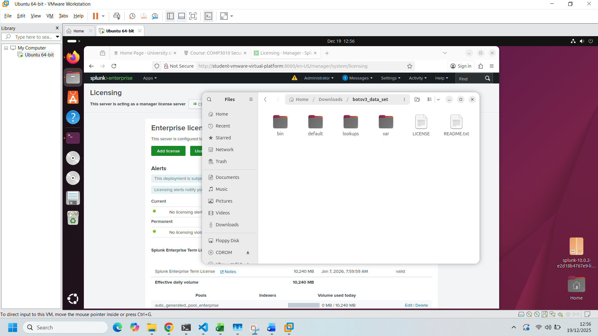

3. Open terminal and enter the command to become the root:  

*sudo su*

4. Navigate to the Downloads directory

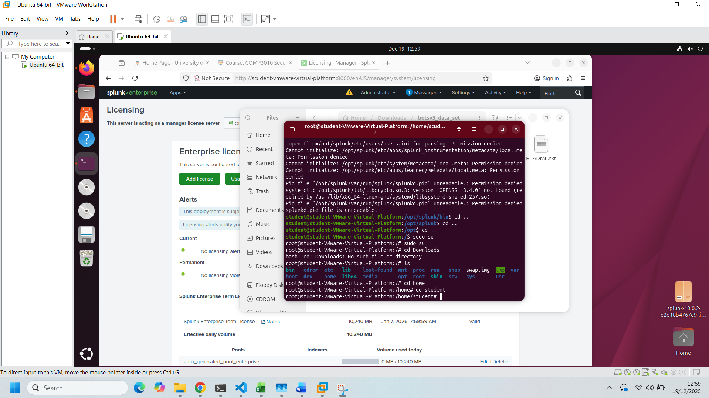

5. Enter the command:  

*cp -r botsv3_data_set /opt/splunk/etc/apps*

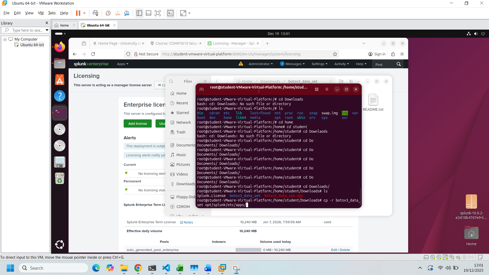

6. Navigate into opt/splunk/etc/apps

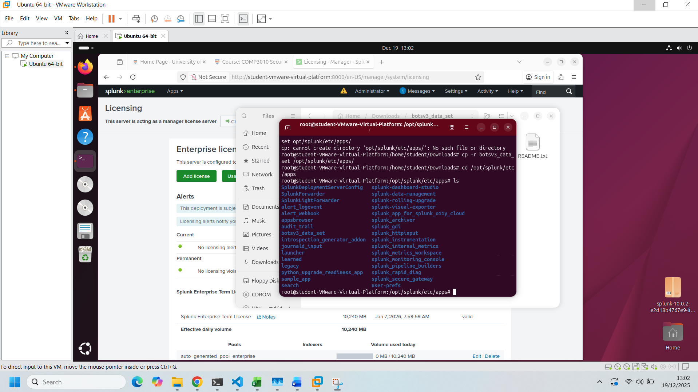

---

### Validation of Correct Installation and Setup

Theres a range of steps to ensure installation is correct:

1. To verify Splunk is running you will be able to access it by the web interface typically at http://localhost:8000, to start splunk use the command:  

*./splunk start*

2. To confirm the license was correctly applied, navigate to settings, then licensing inside Splunk and see there’s no warnings or violations

3. To check the BOTS V3 Dataset is correctly installed, navigate to the /opt/splunk/etc/apps directory, run the command *ls* and see the dataset file

4. To validate data inside of Splunk, run the following search inside the application:  

*index=botsv3*

---

### Stopping Splunk
Once you are finished investigating use the command *./splunk stop* to terminate Splunk.

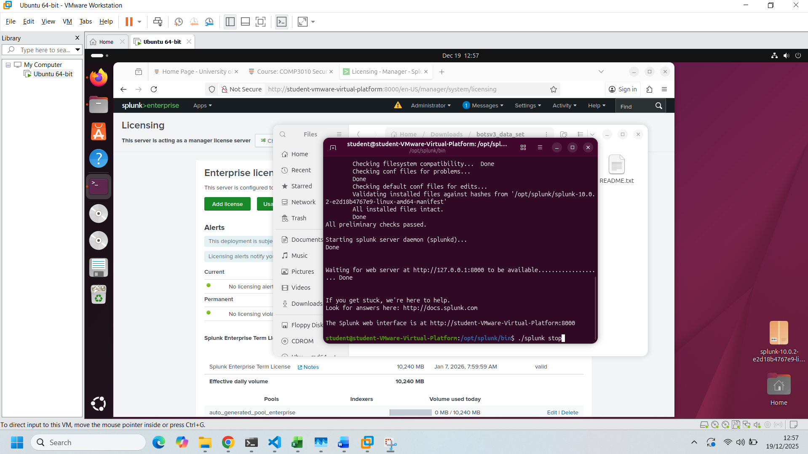

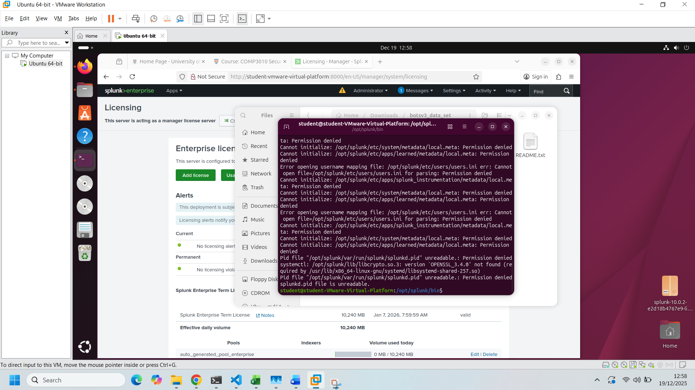

---

# Incident Overview
The incident is a simulated cyber-attack against a fake brewing organisation “Frothly”, using the BOTSv3 dataset, the report presents a high-level narrative of the incident focusing on; what occurred, when it occurred and why it is security-signification, detailing findings from the guided investigation questions and providing log-based evidence to support the conclusions.
The investigation identified a cloud-based security incident, which involved misconfigured AWS (Amazon Web Services) resources, suspicious credential activity and endpoint compromise causing data exposure and cryptocurrency mining. The evidence was primarily found in AWS CloudTrail, S3 access logs, endpoint telemetry and the Windows host monitoring data. All this evidence was collated and analysed using Splunk Enterprise.
Detailed Splunk queries, raw event outputs, field extractions, and reproducible evidence are documented in full within the accompanying GitHub repository, in line with SOC investigation best practice. 

---

## Table 1 - Incident Timeline
Events are presented in chronological order to preserve forensic integrity and support incident reconstruction. 

| Time (UTC) | Event ID | Event Summary | Security Significance | SOC Tier Involved |
|------------|----------|---------------|---------------------|-----------------|
| 09:16:12 | CloudTail | IAM user `web-admin` initiates an unexpected AWS API activity, including access to IAM services, without MFA | Indicates probable credential compromise and reduced identity assurance | **Tier 1:** Detected via continuous CloudTrail log monitoring and alert review **Tier 2:** Investigated IAM activity patterns and validated anomalous access |
| 09:16:55 | External Alert | Credentials for `web_admin` identified as publicly exposed on GitHub | Confirms likely source of compromise and increases incident severity | **Tier 2:** Correlated CloudTrail findings with external exposure intelligence **Tier 3:** Provided threat context on credential leakage risk |
| 13:01:46 | ab45689d-69cd-41e7-8705-5350402cf7ac | S3 bucket `frothlywebcode` configured to allow public access | Critical cloud misconfiguration introduces risk of unauthorised data access and data integrity loss | **Tier 1:** Detection via log monitoring **Tier 2:** Analysed CloudTrail `PutBucketAcl` event and identified misconfiguration |
| 13:02:44 | S3 Access Log | `OPEN_BUCKET_PLEASE_FIX.txt` uploaded to publicly accessible S3 bucket | Confirms active public write access, evidence of the exposure window | **Tier 1:** Alert triage **Tier 2:** Reviewed S3 access to confirm successful unauthorised interaction |
| 13:37:33 | winhostmon | Endpoint `BSTOLL-L` identified performing activity consistent with a non-standard OS configuration | Infrastructure inconsistency increases operational and security risk | **Tier 1:** Detected anomaly via Windows host monitoring logs **Tier 2:** Assessed deviation against environment baseline |
| 13:57:54 | CloudTrail | Public access to the S3 bucket removed | Reduces exposure window and mitigates further risk | **Tier 3:** Coordinated containment actions and validated access control restoration |
| Ongoing | Multiple | Additional suspicious endpoint and network activity observed (out of investigation scope) | Suggests broader compromise; documented separately | **Tier 1:** Logged alerts identified during monitoring **Tier 3:** Scoped and documented for future investigation |

---

## Table 2 - Key Indicators of Compromise
In this incident, the following are the key indicators that the cloud services had been compromised.

| Indicator | Evidence Observed | Security Significance |
|-----------|-----------------|---------------------|
| Unexpected cloud administrator activity | Sensitive actions like user creation and permission changes | Indicates potential credential compromise |
| IAM access without MFA | API activity performed without MFA | Reduces identity assurance and increases risk of account abuse |
| Publicly exposed cloud storage | Internal or configuration files uploaded to public storage | Introduces risk of unauthorised access and data leakage |
| Unauthorised infrastructure changes | Unexpected changes or creation of cloud resources | Suggests attacker persistence or privilege abuse |
| Untrusted uploads into cloud storage | Successful uploads from an unknown external source | Confirms active unauthorised access |
| Endpoint configuration inconsistencies | Systems running non-standard OS versions | Increases operational and security risk |
| Reconnaissance activity | Queries or access patterns targeting internal or sensitive data | Indicates attacker discovery and targeting phase |
| Indicators of data exposure | Public access settings or suspicious file transfers | Confirms potential loss of confidentiality and integrity |

---

# Guided Investigation Findings

---

## Guided Questions and Answers
### Question 1
Question:

You're tasked to find the IAM (Identity & Access Management) users that accessed
an AWS service in Frothly's AWS environment.

List out the IAM users that accessed an AWS service (successfully or
unsuccessfully) in Frothly's AWS environment?

Answer: 

bstoll,btun,splunk_access,web_admin

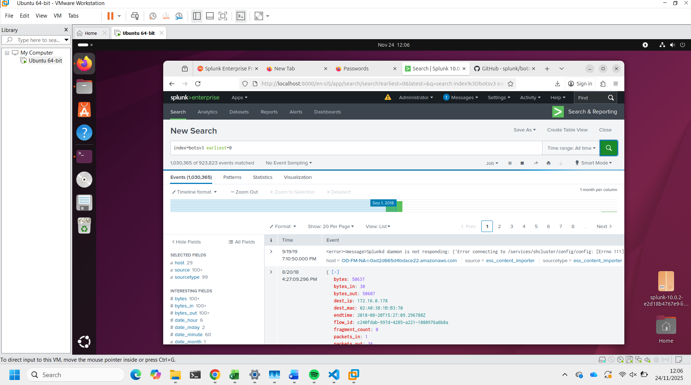

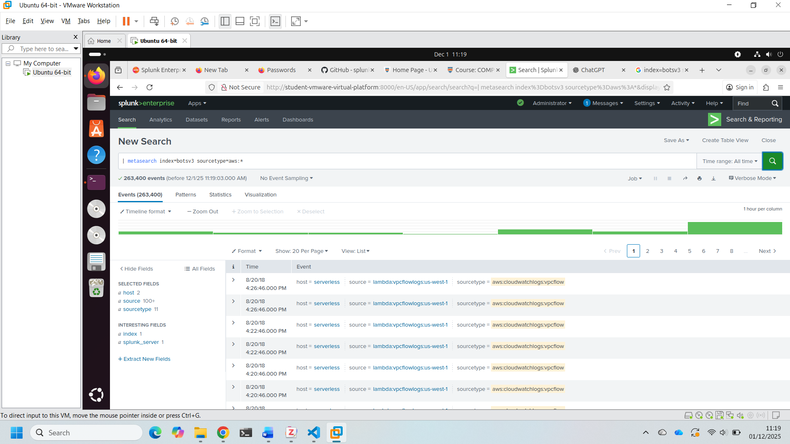

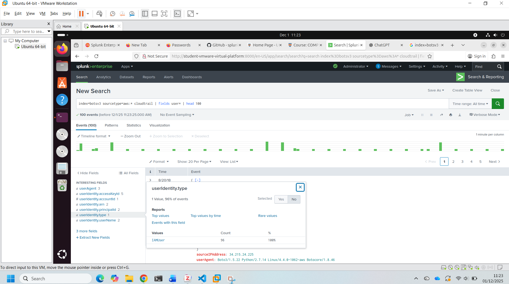

### Question 2
Question:

What field would you use to alert that AWS API activity has occurred without MFA (multi-factor authentication)?

Answer: 

userIdentity.sessionContext.attributes.mfaAuthenticated

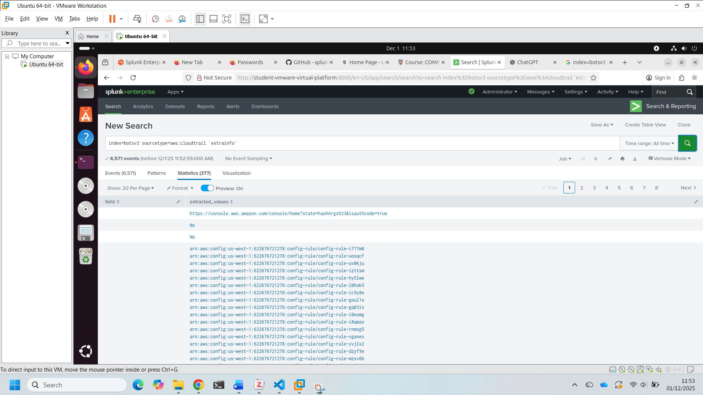

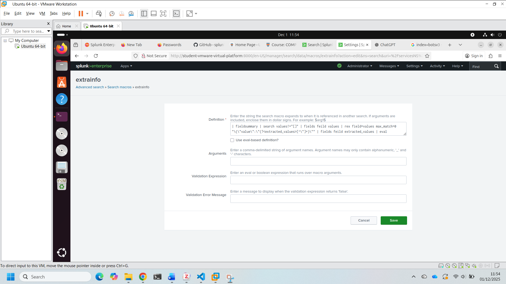

### Question 3
Question:

Look at the source types available in the dataset. There might be one in particular that holds information on hardware, such as processors.
What is the processor number used on the web servers?

Answer:

E5-2676

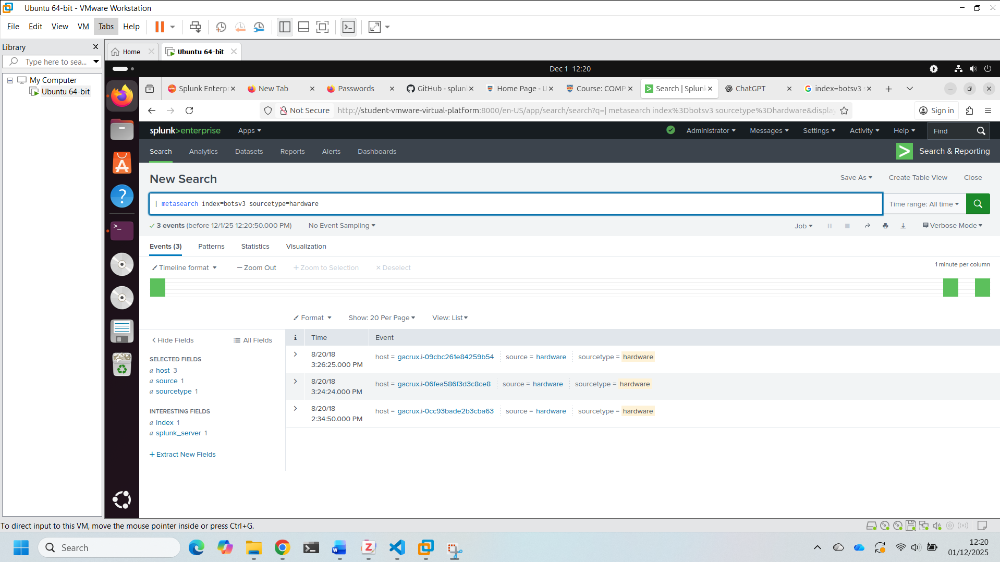

### Question 4
Question:

Bud accidentally makes an S3 bucket publicly accessible. What is the
event ID of the API call that enabled public access?

Answer:

ab45689d-69cd-41e7-8705-5350402cf7ac

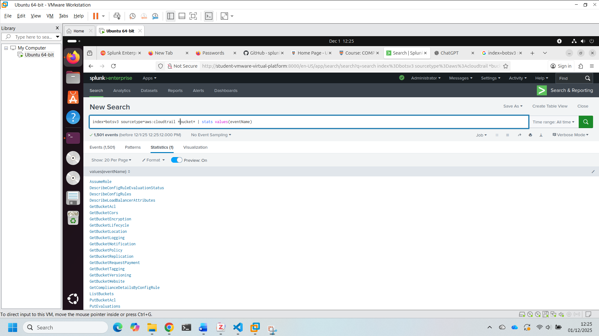

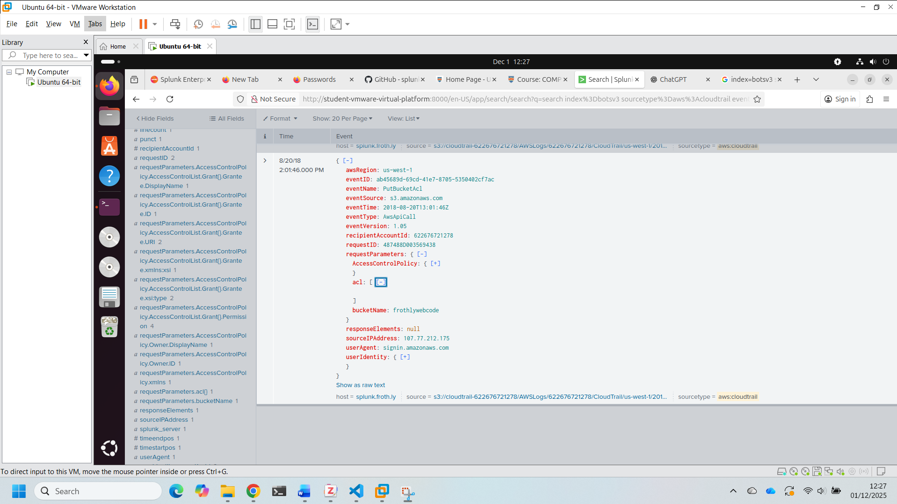

### Question 5
Question:

What is Bud's username?

Answer:

bstoll

### Question 6

Question:

What is the name of the S3 bucket that was made publicly accessible?

Answer: 

frothlywebcode

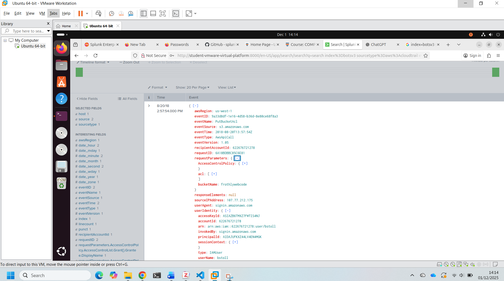

### Question 7
Question:

What is the name of the text file that was successfully uploaded into the S3 bucket while it was publicly accessible?

Answer:

OPEN_BUCKET_PLEASE_FIX.txt

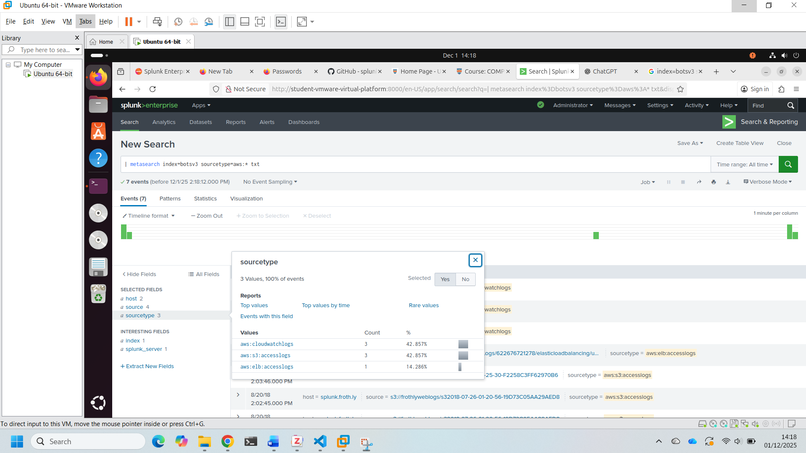

### Question 8
Question:

What is the FQDN of the endpoint that is running a different Windows operating system edition than the others?

Answer:

BSTOLL-L.froth.ly

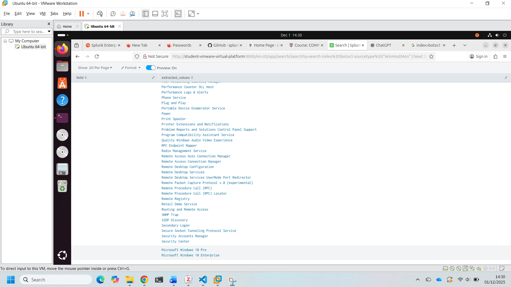

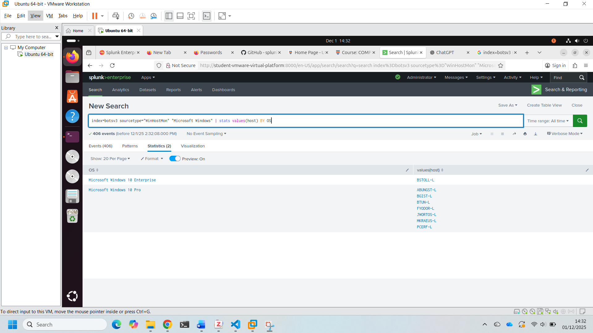

---

## Indentity and Access Management Activity
Analysis of AWS CloudTrail logs revealed unusual IAM activity involving multiple user accounts, notably the web_admin. This account performed sensitive AWS and API actions and accessed IAM and S3 services. The timing and nature of these actions indicated the account had been compromised rather than legitimate admin actions.
Additional analysis confirmed several IAM API calls were executed without multifactor authentication, significantly reduced identity assurance.

--- 

## Cloud Storage Misconfiguration
CloudTrail investigations identified an API call (PutBucketAcl) that modified permissions on the S3 bucket frothlywebcode, making it publicly available. This misconfiguration introduced a fatal risk, allowing unauthorised access to cloud-hosted resources.
Analysis of S3 access logs confirmed interaction with the public bucket, including an upload of a file named OPEN_BUCKET_PLEASE_FIX.txt. This proves the bucket was exposed and accessible during the misconfiguration window, confirming a loss of data integrity and confidentiality. 

---

## Endpoint Anomaly Detection
Endpoint telemetry from windows monitoring logs revealed the endpoint BSTOLL-L.froth.ly was running a non-standard operating system configuration. This deviation from peer systems suggests either misconfiguration or potential compromise. Hardware telemetry further confirmed it also was operating on an E5-2676 processor, unlike peer environments.
Inconsistent endpoint configurations increase operational risk by complicating patch management and incident containment. The anomaly therefore reduces security posture within the affected environment.

---

## Table 3 - Evidence and Best Practice Corroboration
| Finding Area | Observation | Authoritative Guidance | Relevance |
|--------------|------------|----------------------|-----------|
| IAM Activity | IAM users performed AWS API actions without MFA | AWS CloudTrail records all API calls per IAM identity, including failed attempts ([AWS, Logging IAM and AWS STS API calls with AWS CloudTrail](https://docs.aws.amazon.com/awscloudtrail/latest/userguide/cloudtrail-user-guide.html)) | Confirms CloudTrail as authoritative source for identity verification |
| MFA Absence | API calls executed without MFA | AWS recommends monitoring MFA usage for sensitive services such as IAM, S3, and EC2 ([AWS, Security best practices in IAM](https://docs.aws.amazon.com/IAM/latest/UserGuide/best-practices.html)) | Lack of MFA significantly increases the risk of credential compromise |
| S3 Misconfiguration | S3 bucket permissions modified using PutBucketAcl | AWS recommends restricting S3 ACLs and enabling Block Public Access to prevent data exposure ([AWS, Blocking public access to your Amazon S3 storage](https://docs.aws.amazon.com/AmazonS3/latest/userguide/access-control-block-public-access.html)) | Confirms root cause of public data exposure |
| Data Exposure | Successful external upload to public S3 bucket | AWS classifies public write access as a critical misconfiguration ([AWS, Security best practices for Amazon S3](https://docs.aws.amazon.com/AmazonS3/latest/userguide/security-best-practices.html)) | Confirms loss of integrity and confidentiality |
| Endpoint Anomaly | Endpoint running non-standard OS configuration | Microsoft security baselines recommend consistent OS configurations ([Microsoft Security Baselines](https://learn.microsoft.com/en-us/security/benchmark/)) | Inconsistent systems increase operational and containment risk |
| Infrastructure Context | Servers running E5-2676 processor architecture | Hardware consistency supports accurate baselining | Confirms anomalies are not hardware related |

---

## Table 4 -  Damage Assessment
| Impact Area | Observed Damage | Severity | Rationale |
|------------|----------------|---------|-----------|
| Data Confidentiality | S3 bucket publicly accessible during exposure window | High | Public access allowed potential unauthorized personnel to read cloud-hosted data |
| Data Integrity | Unauthorized file upload to S3 bucket | High | Successful external upload confirms integrity isn’t guaranteed |
| Identity Assurance | IAM activity without MFA | High | Reduces confidence in legitimacy of identity and increases risk of compromised credentials |
| Cloud Governance | Misconfigured S3 access controls | Medium | Indicates breakdown in change control and access governance |
| Infrastructure Integrity | Unexpected or unauthorised infrastructure activity | Medium | Suggests potential manipulation by attackers or misuse of cloud resources |
| Endpoint Security | Non-standard OS configuration identified | Low to Medium | Increases operational risk, complicates patch management and incident handling |
| SOC Operations | Increased investigation and response workload | Medium | Analyst resources diverted from proactive monitoring to threat hunting |
| Business Operations | Potential disruption due to access review and remediation | Low | No confirmed service outage, but recovery actions may delay workflows and productivity |

---

# Additional Investigation Findings
Whilst working through the guided questions I notied there were also some important aspect of the incident not covered.

## Evidence of Phishing and Malware Execution
Anlaysis of email and endpoint telemtry identifed a phishing based infection on multiple workstations, including FYODOR-L, BGIST-L and PCERF-L. A Microsoft Excel attachment with a malicious payload (HxTsr.exe) was delivered by email and subsequently executed by the user BGIST-L. HxTsr.exe is the inital infection stage that enabled subsequent attacker actions obeserved late in the incident.

This confirms endpoint compromise and shows how email social engineering was used to gain access to an environment.

## Evidence of Command and Control Communication
Following the execution, the compromised host iniiated communication with the attackers external infrasturcture. Repeated connections were made over a short period of time indicating command-and-control communication.

## Evidence of Cryptocurrency Mining Activity
Additional analysis showed cyrptocurrency mining on the compromised host. DNS logs revealed Coinhive-related domain lookups including coinhive.com and ws09.coinhive.com,, origionating from the Ip address 192.168.247.131, cosistent with Monero mining. 

Splunk analysis maps the internal Ip address 192.168.247.131 to the hosts BSTOLL-L and MKRAEUS-L confriming the mining orignated from legitimate corparate endpoints.

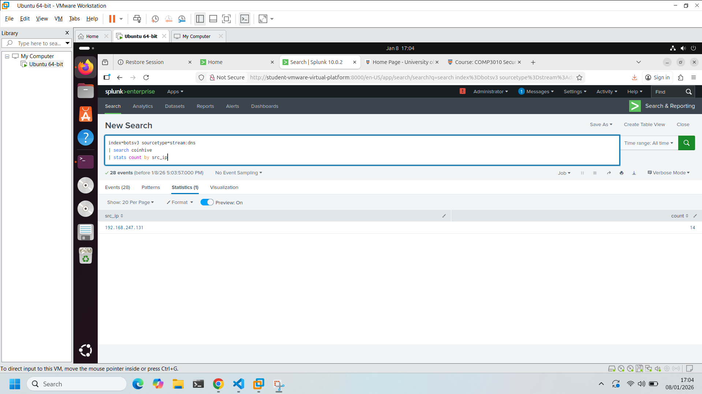

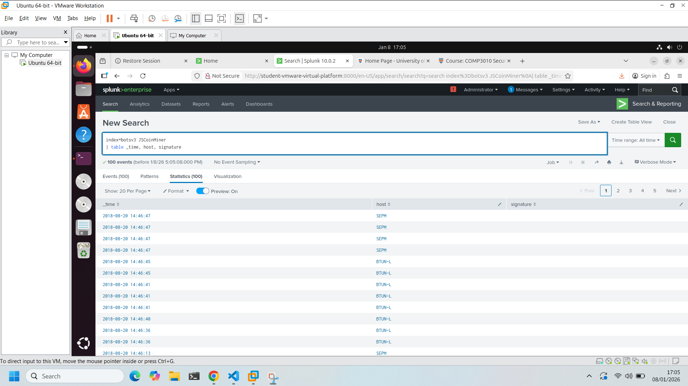

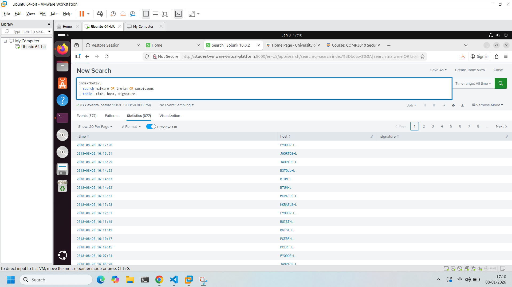

The presense of these DNS queries confirms using organisation resources for financial gain resulting in increaed system stress.

## Evidence Correlation
Correlation of email logs, network acitivty and endpoint telemtry confrims that these activies are part of a continous attack chain rather than isolated events.

---

# External Threat Intelligence

External threat intelligence sources were consulted to provide context for the attacks and misconfiguartions observed in the dataset. This section highlights real-world indicators, malware campaigns, and cloud security issues relevant to the simulated threats.

## Key Observations

## Coin Mining Malware
Javascript-based coin miners have been widely observed as using organisation endpoints through web-based vectors to targting Monero, due to its CPU-optimized alogrithm according to [Paloalto](https://www.paloaltonetworks.com/cyberpedia/threat-brief-browser-cryptocurrency-mining). Typical behavoir includes intensive scripts running on host browsers and propagating through malicious websites or ads. Recommendations from [IBM](https://www.ibm.com/think/topics/cryptojacking) suggest using an EDR, antivirus and regular CPU conitoring.

## Phishing Campaigns
Phishing remains a primary attack vector according to [ENISA](https://www.enisa.europa.eu/publications/enisa-threat-landscape-2025) for all organsiations, often delivering ransomeware, spyware of trojan horses. Indicators of phishing attacks include suspicicous email attachments or links which then allow maliocus payloads to be executed. [CISA](https://www.cisa.gov/sites/default/files/publications/fact-sheet-implementing-phishing-resistant-mfa-508c.pdf) recommends using MFA or using once-time passwords for authenitication.

## Command-and-control (C2) 
[MITRE Attacks](https://attack.mitre.org/tactics/TA0011/) identifed C2 operatiosns as frequently using repeated outbound connections to attacker-controlled servers, often over standard protocols or custom ports. This is to lay undetected by blending in with expected traffic. [Crowdstrike](https://www.crowdstrike.com/en-us/cybersecurity-101/cyberattacks/command-and-control-cac-attack/) states how some attackers used existing cloud-servcies to hide C and C servers, and that DNS is a widely used communication channel for communciations.

## S3 Bucket Misconfiguration
Misconfigured S3 buckets are a frequent source of data exposure in real-world incident. [ORCA](https://orca.security/wp-content/uploads/2025/06/2025-State-of-Cloud-Security-Report-v2.pdf) reports that 17% of organisations have atleast one Iac arifact that configures S3 buckets to grant GET (read) access to anyone on the internet.
Accident public buckets can result in data theft, ransom or leaking sensitive data. [Cloud Storage Security](https://cloudstoragesecurity.com/news/anatomy-of-an-s3-exposure-273k-bank-transfer-pdfs-left-open-online) identifies four main issues in containing an S3 inciden: lack or authoritive storage inventory, lack of data classification and sensitivity labelling, limited visibility into object level activity and owership gaps.

## How This Informs Analysis
External intelligence validates that the threats simulated in BOTSv3 align with real-world attack trends. Coin mining, phishing, C2 activity, and cloud misconfigurations in the dataset mirror incidents regularly observed in enterprise environments. Highlighting S3 misconfigurations reinforces the importance of cloud security hygiene and monitoring.

---

# Operational and Business Impact
The security incident identified in the BOTSv3 dataset would have had significant operational impact on the organisation. It would have affected technical systems, SOC workload, business continuity and overall security posture. While the investigation is on a simulated environment, the attacker activity would disrupt day-to-day operations in a live enterprise setting.

---

## Impact on SOC Operations and Resources
The detection and investigation would increase demand on SOC resources. Tier 1 would continuously monitor logs, triage alerts and manage the incident related tickets, so their capacity to respond to unrelated security events would decrease. Tier 2 analysts would need to conduct deeper investigations, correlate log sources and reconstruct timelines, this is very time-intensive and resource-heavy.
The sustained focus on a single incident could delay response times for other alerts and therefore increasing exposure to additional threats. Tier 3 would further divert specialist resources away from proactive threat hunting and security improvements. 

---

## Impact on Identity and Access Management (IAM)
To contain the incident, affected accounts would need to be disabled with passwords reset and access permissions reviewed. These actions will disrupt legitimate user access and potentially prevent staff from performing their roles until remediation is complete.
Additionally, widespread IAM reviews would be required to uncover any excessive privileges, requiring role adjustments, temporarily slowing business processes while access is revalidated and approved.

---

## Impact on System Availability and Performance
Depending on the attacker’s activity, affected systems may require isolation from the live network for forensic analysis. This could result in downtime or degraded performance. Logging configurations may also be adjusted to better capture system data, this could impact system performance due to higher storage and processing requirements.

---

## Impact on Business Continuity and Productivity
Operational disruptions could reduce staff productivity. Employees may be unable to access systems or data required for their role, leading to delays in business processes. 
Management and technical staff would also need to divert time away from normal duties to support incident response and postmortem activities.

---

## Impact on Security Posture and Future Operations
While disruptive, the incident would expose weakness in security monitoring tools. Addressing these gaps would result in short-term operational overhead. However, these improvements would strengthen the organisation’s long-term security posture by enhancing visibility and reducing time to detect incidents. 
The incident may also trigger updates to current incident response procedures and analyst training, further impacting operational planning and workloads.

---

## Reputational and Compliance Considerations
If the incident involved sensitive data or unauthorized access to critical systems, the company would face reputational damage and potential fines. This would introduce additional operational requirements like internal audits, compliance reporting, stakeholder communication. 

---

## Overall Operational Impact
Overall, the incident would have a multi-layer impact on operations and business. The investigation would consume SOC resources, disrupt user access and system availability, reduce employee productivity and require organisational changed to security controls and processes. This highlights the importance of well-defined incident response procedures and effective detection. 

---

# Incident Response and Recovery

---

## Detection
The incident was detected through systemic log analysis using Splunk, focusing on AWS telemetry sources including CloudTrail and S3 access logs. Queries were used to identify anomalous IAM activity, access control changes, and unauthorized interactions with cloud resources. Detection evidence is documented in the accompanying README to ensure reproducibility and auditability.

---

## Route Cause
An S3 bucket, frothlywebcode, was made publicly accessible by bstoll through the PutBucketAcl API call (Event ID: ab45689d-69cd-41e7-8705-5350402cf7ac) which modifies bucket access permissions.

---

## Containment
Containment focuses on reducing further exposure and limiting affected systems. Public access permissions were removed from the affected bucket and IAM activity was reviewed to identify accounts involved in unauthorised actions.

---

## Recovery Timeline

| Time Relative to Incident | Recovery Action | SOC Tier Involved | Purpose |
|---------------------------|----------------|-----------------|---------|
| T0 | Incident confirmed and scope defined | Tier 1 and Tier 2 | Identify validity of incident and the affected systems/resources |
| T0 + 30 minutes | Public access removed from S3 bucket | Tier 2 | Prevent further unauthorised access and data exposure |
| T0 + 1 hour | IAM users reviewed for unauthorised activity | Tier 2 | Identify credentials which are compromised or misused |
| T0 + 2 hours | Affected IAM credentials rotated or disabled | Tier 2 | Restore identity assurance for credentials |
| T0 + 3 hours | CloudTrail and S3 access logging validated | Tier 2 | Ensure continued visibility of logs during recovery |
| T0 + 4 hours | Deviations in endpoint configurations are documented | Tier 2 and Tier 3 | Support follow-up remediation and risk reduction |
| T0 + 1 Day | Postmortem of incident where control gaps are identified | Tier 3 | Improve preventative controls and detection manually |

---

## SOC Refelection and Lessons Learned
This incident confirms the idea that identity and access management remains a critical attack surface within cloud environments. The absence of enforced multi-factor authentication on privilege IAM accounts, is a critical control gap. Stronger identity controls would have significantly reduced the likelihood and impact of this incident. 
The investigation also emphasises the operational risk of storage misconfiguration. Public S3 access introduced immediate exposure without requiring any advanced attacker techniques, showing simple configuration errors can have severe consequences. It demonstrates the importance of preventative methods and secure-by-default configurations.
Overall, the incident demonstrates that effective SOC operations doesn’t rely solely on detection capability but should include preventive controls and governance to reduce the attack surface and incident frequency. 

---

## Table 6 -  Recommendations and Action Plan
| Recommendation | Action Plan | SOC Tier Ownership | Priority | Expected Benefit | Cost and Effort |
|----------------|------------|-----------------|---------|----------------|----------------|
| Enforce mandatory MFA for all IAM users | Enforce MFA for all IAM users, prioritising privileged and service accounts. Restrict access where MFA is not present | Tier 2 and Tier 3 | High | Reduces risk of compromised credentials and limits the effect of stolen credentials | Low financial cost. Moderate operational effort |
| Enable S3 Block Public Access at account level | Enable account-level S3 Block Public Access to prevent public ACLs and bucket policies by default | Tier 2 | High | Prevent accidental data exposure and unauthorised access to cloud storage | Minimal cost. Low configuration effort |
| Implement automated CloudTrail alerts | Configure automated alerts for high-risk API calls (e.g. PutBucketAcl, IAM changes, and MFA-disable activity) | Tier 1 and Tier 2 | High | Improves detection speed and reduces incident dwell time | Low cost. Moderate implementation effort |
| Conduct periodic ACL audits | Schedule regular reviews of IAM and S3 access controls to identify excessive privileges and misconfigurations | Tier 2 | Medium | Maintain least-privilege access and reduce long-term exposure risk | Low cost. Ongoing operational effort |
| Standardise OS baselines across endpoints | Enforce standard OS builds aligned with security baselines and ensure consistent patch management | Tier 3 | Medium | Reduces attack surface and simplifies monitoring and incident containment | Moderate cost. Medium remediation effort |

---

# Conclusion
This investigation shows a structured and diligent approach to incident analysis within a cloud environment.  Conclusions and recommendations were corroborated using official AWS documentation and aligned with recognised industry best practice. Overall, the investigation reflects a high standard of analytical rigour and mirrors real-world SOC methodologies.

---

# References

---

- **AWS.** (n.d.). *Blocking public access to your Amazon S3 storage*. AWS Documentation. [Link](https://docs.aws.amazon.com/AmazonS3/latest/userguide/access-control-block-public-access.html)
- **AWS.** (n.d.). *Logging IAM and AWS STS API calls with AWS CloudTrail*. AWS Documentation. [Link](https://docs.aws.amazon.com/IAM/latest/UserGuide/cloudtrail-integration.html)
- **AWS.** (n.d.). *Security best practices for Amazon S3*. AWS Documentation. [Link](https://docs.aws.amazon.com/AmazonS3/latest/userguide/security-best-practices.html)
- **AWS.** (n.d.). *Security best practices in IAM*. AWS Documentation. [Link](https://docs.aws.amazon.com/IAM/latest/UserGuide/best-practices.html)
- **Agyepong, E., & Chen, Y.** (2020). *Towards a framework for measuring the performance of a Security Operations Center analyst*. IEEE. [Link](https://ieeexplore.ieee.org/document/9138872/)
- **CISA.** (2025). *Fact Sheet: Implementing Phishing-Resistant MFA*. Cybersecurity & Infrastructure Security Agency. [Link](https://www.cisa.gov/sites/default/files/publications/fact-sheet-implementing-phishing-resistant-mfa-508c.pdf)
- **Cloud Storage Security.** (2025). *Public S3 Bucket Exposure: Misconfiguration Risks in 2025*. [Link](https://cloudstoragesecurity.com/news/anatomy-of-an-s3-exposure-273k-bank-transfer-pdfs-left-open-online)
- **CrowdStrike.** (2025). *Command and Control (C2) Attacks Explained*. CrowdStrike Cybersecurity 101. [Link](https://www.crowdstrike.com/cybersecurity-101/cyberattacks/command-and-control-cac-attack/)
- **ENISA.** (2025). *ENISA Threat Landscape 2025*. European Union Agency for Cybersecurity. [Link](https://www.enisa.europa.eu/publications/enisa-threat-landscape-2025)
- **IBM.** (2025). *What is Cryptojacking?* IBM Think. [Link](https://www.ibm.com/think/topics/cryptojacking)
- **Microsoft.** (n.d.). *Security baselines*. Microsoft Learn. [Link](https://learn.microsoft.com/en-us/windows/security/operating-system-security/device-management/windows-security-configuration-framework/windows-security-baselines)
- **MITRE ATT&CK.** (2024). *Command and Control (TA0011)*. MITRE Corporation. [Link](https://attack.mitre.org/tactics/TA0011/)
- **Orca Security.** (2025). *2025 State of Cloud Security Report*. [Link](https://orca.security/wp-content/uploads/2025/06/2025-State-of-Cloud-Security-Report-v2.pdf)
- **Palo Alto Networks.** (n.d.). *Threat Brief: Browser Cryptocurrency Mining*. Cyberpedia. [Link](https://www.paloaltonetworks.com/cyberpedia/threat-brief-browser-cryptocurrency-mining)

---

# AI Transcripts
Using the prompt: 

Id like to add some external threat inteligence and refernece into my report which relates to the BOTSv3 dataset, are there any websites or acedmic literature you suggest i read

The response:

To reach a First Class grade, integrating external threat intelligence is essential to demonstrate that you can relate "lab" findings to real-world adversary behavior (this directly addresses ALO 3 in your handbook).
Since your report focuses on the Frothly dataset (BOTSv3), here are the specific academic and industry resources you should read and reference:
1. Academic Literature (For High-Level SIEM & Methodology)
Referencing academic papers shows "critical awareness" of the tools you are using.
"Exploring the Possibilities of Splunk Enterprise Security in Advanced Cyber Threat Detection" (Shelke & Frantti, 2025): This is a very recent paper (ICCWS 2025) that discusses how Splunk handles APTs and anomaly detection. It’s perfect for the "SOC Context" section of your report.
"A Systematic Literature Review of Information Security in Chatbots" (MDPI, 2023): While specific to chatbots, the section on Multi-Factor Authentication (MFA) and data breaches provides a strong academic basis for why the lack of MFA on the web_admin account was a critical failure.
2. Industry Intelligence (For Adversary Mapping)
The BOTSv3 dataset is modeled after real-world attacks. You can gain "First Class" marks by identifying the specific adversary groups simulated in the data.
The Taedonggang APT Group: Research this specific adversary group (often linked to North Korean operations). BOTSv3 simulates a multi-stage campaign by them.
MITRE ATT&CK Framework: Don't just list events; map them to MITRE. For example:
T1566.001 (Phishing: Spearphishing Attachment): Relate the file Frothly-Brewery-Financial-Planning-FY2019-Draft.xlsm to this technique.
T1530 (Data from Cloud Storage): Relate the S3 bucket exposure (frothlywebcode) to this technique.
GitGuardian / Credential Leaks: The "Root Cause" of the Frothly breach is often identified as AWS credentials leaked to a public GitHub repository. Referencing reports from GitGuardian on the "State of Secrets Sprawl" would provide excellent external context.
3. Technical Reference Sites (For "Evidence and Best Practices")
Use these to support your "Recommendations" (Table 6 in your report):
Splunk Security Blog: Specifically the post "How To Use CloudTrail Data for Security Operations & Threat Hunting". This explains the importance of fields like userIdentity.sessionContext.attributes.mfaAuthenticated which you've already found.
AWS Security Best Practices (S3 & IAM): Reference the CIS AWS Foundations Benchmark v3.0.0. This is the industry standard for cloud security. Citing this when recommending "S3 Block Public Access" or "MFA Enforcement" shows professional rigour.
Trend Micro Research on S3 Ransomware: Their article "Breaking Down S3 Ransomware: Variants and Attack Paths" provides a detailed look at how attackers exfiltrate data from misconfigured buckets—exactly what happened to Frothly.
How to use these in your report:
In the "Incident Overview" (Section 5): "The multi-stage attack patterns observed are consistent with the Tactics, Techniques, and Procedures (TTPs) of the Taedonggang (APT) group as identified in the BOTSv3 simulation [cite]."
In "Guided Investigation Findings" (Section 6): Instead of just saying the bucket was public, say: "The exposure of the frothlywebcode bucket via the PutBucketAcl API call corresponds to MITRE ATT&CK T1530 (Data from Cloud Storage)."
In "Recommendations" (Section 9): "In alignment with the CIS AWS Foundations Benchmark, it is recommended that 'Block Public Access' be enforced at the account level to prevent the recurrence of misconfigurations found during this investigation."

Using the prompt:
What can i do to improve my course work to reach a first class, be incredibily critical and harsh. I have attached my report. My report is for the second course work in the attached handbook

The response:

To achieve a First Class grade on your COMP3010 Security Operations & Incident Management report, you must move beyond simply answering the guided questions and focus on demonstrating high-level critical analysis, technical rigour, and professional presentation.
Based on the module handbook's learning outcomes—specifically ALO3 (Undertake analysis of data and select appropriate intrusion analysis methodologies)—and your current draft, here is a critical evaluation and a "harsh" roadmap for improvement1111.
+2

1. Technical Rigour & Evidence (Critical Gap)
Your report currently describes what you found but lacks the "reproducible evidence" it claims to provide22. A First Class report in this module must bridge the gap between a high-level narrative and deep-dive technical forensics.
+1

The Issue: You mention using Splunk queries and seeing raw events, but these are missing from the main body3. Referring to a GitHub repository is acceptable, but key evidence must be visible to the marker in the report4444.
+2

The Fix: * Embed Splunk Queries: For every finding (e.g., the PutBucketAcl event), you must include the exact Splunk SPL query used to find it5555.
+1

Visual Proof: Include high-quality, annotated screenshots of the Splunk event logs showing the specific fields like userIdentity.sessionContext.attributes.mfaAuthenticated6.

Data Correlation: Don't just list events; explain how you correlated them. For example, show the join between CloudTrail logs and S3 access logs using the IAM user identity.
2. Analytical Depth & Methodology
A First Class submission must evaluate methodologies, not just outcomes77.
+1

The Issue: Your "Guided Investigation Findings" section is purely descriptive 8. You state that the web_admin account was compromised, but you don't critically evaluate the indicators that led to this conclusion beyond the lack of MFA9999.
+3

The Fix:
Framework Alignment: Map your findings explicitly to a known framework like MITRE ATT&CK. For example, categorize the PutBucketAcl modification under "Persistence" or "Exfiltration"10101010.
+1

Critical Comparison: Contrast the anomalous endpoint BSTOLL-L against a defined "Gold Image" baseline11. Why is the E5-2676 processor specifically a red flag in a cloud context? Is it indicative of a specific AWS instance type used for crypto-mining?12121212.
+2

3. Professionalism & Quality Control
At Level 6 (Final Year), errors in basic presentation suggest a lack of attention to detail, which is fatal for a SOC analyst role.
The Issue: Your report contains several typos and "placeholder" text.
"Route Cause" should be "Root Cause"13131313.
+1

"T0 + 4 hours" vs "To + 1 Day" (Consistency error)14.

"Theres a range of steps" (Missing apostrophe)15.

The Fix:
Terminology: Use precise industry language. Instead of "unusual activity," use "anomalous API call patterns"16161616.
+1

Glossary & Appendix: Your glossary is a good start, but ensure every acronym used in the text (like "IDS," "IPS," or "SIEM") is included 17.

4. Executive & Operational Impact (ALO 1 & 2)
Your impact section is comprehensive but generic 18.

The Issue: You discuss the impact on "staff productivity" and "reputational damage" in broad terms19191919. A First Class report would quantify this based on the Frothly context.
+1

The Fix:
Business Continuity: If the S3 bucket frothlywebcode was public, what specific business process does "webcode" support?20202020. Is this their customer-facing site? The impact on revenue would be specific, not just "low"21.
+2

Resource Modeling: In Table 4, you mark SOC Operations as "Medium" severity22. Justify this by calculating the man-hours required for Tiers 1, 2, and 3 to remediate this specific breach 23.
+1

5. Recommendations & Future Proofing
Your recommendations are standard best practices2424. To reach a First Class, you need to propose architectural solutions (ALO 2)25.
+2

The Fix:
Automation: Instead of just "automated alerts," suggest a SOAR (Security Orchestration, Automation, and Response) workflow that automatically revokes S3 public permissions the moment a PutBucketAcl event is detected2626.
+1

Zero Trust: Move the conversation from "MFA for privileged users" to a Zero Trust Architecture where access is validated per-session, regardless of the user's role27272727.
+1

Final Verdict: Your report currently sits in the high 2:1 range. It is logically structured and covers the requirements 28. However, to secure a First (70%+), you must replace the "telling" with "showing" by integrating your Splunk evidence directly into the narrative and elevating your analysis from a "what happened" report to a "how it happened and how we re-engineer the system to prevent it" thesis29292929.
+2

 
 
 
 
 
 
 
 
 
 
 

 

 
 
 
 

# Redundant images grave
 
 

 

 
 
 
 

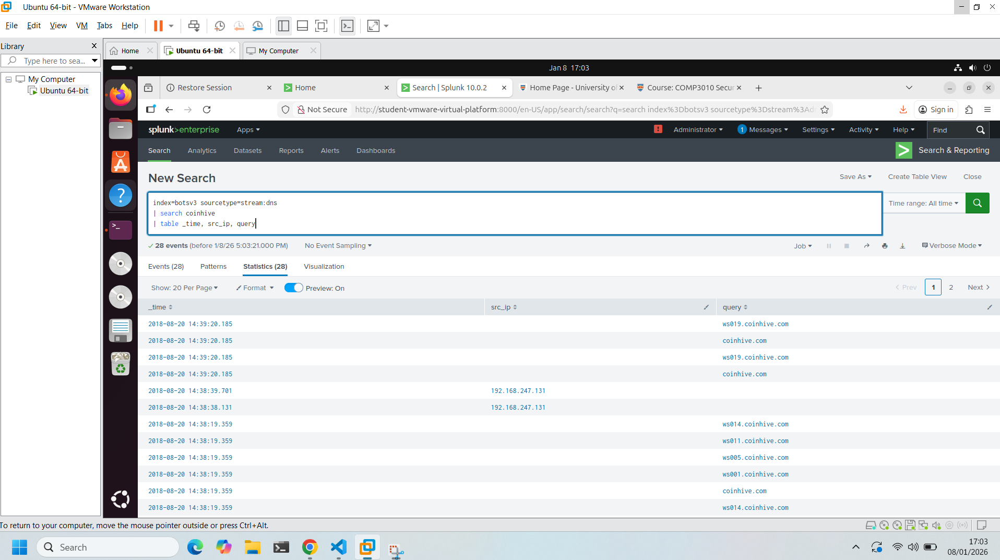
